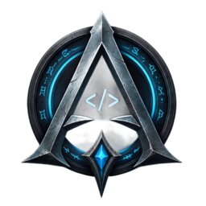
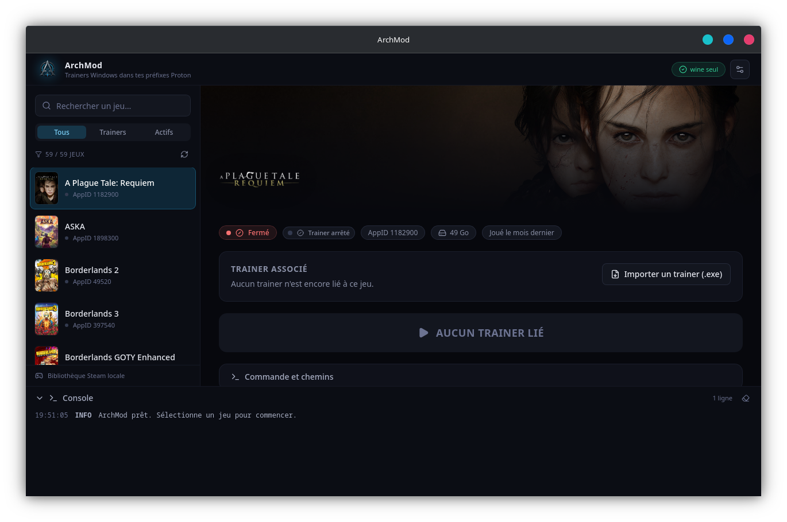

<div align="center">
  
  <h1>ArchMod</h1>
  <p><strong>A native WeMod for Linux.</strong> A cheat panel for your Steam games under Proton: run your Windows trainers in the right prefix, or switch on memory options written by the community.</p>
  <p>
    
    
    
    
  </p>
  <p><a href="README.fr.md">🇫🇷 Lire en français</a></p>
</div>

<p align="center">
  
</p>

---

## What it does

ArchMod has three layers, each usable on its own.

### 1. Windows trainer launcher — *working*

- **Steam library scan** — every known root (native, `~/.steam/root`, Flatpak), every drive declared in `libraryfolders.vdf`, every `appmanifest_*.acf`.
- **Trainer vault** — each AppID is bound to an `.exe` (FLiNG, MrAntiFun, Cheat Happens…) in `~/.config/ArchMod/config.json`.
- **Injection into the Proton prefix** — `protontricks`, with two native fallbacks when it is absent.
- **Prefix preparation** — diagnoses what stops a trainer from starting (.NET versus Wine-Mono, the reported Windows version, the Proton flavour) and fixes it in one click.
- **Live game detection** and a **real-time console**, Wine output streamed line by line.

### 2. Native option engine — *in progress*

Read and write a Proton game's memory **without Wine or Cheat Engine**: a game started by Steam is an ordinary Linux process. Byte-pattern scanning, pointer-chain resolution, value freezing, and code detours.

### 3. Community profiles — *foundation laid*

Finding memory addresses cannot rest on one person. ArchMod gives the **panel** to the player and the **exchange format** to whoever knows how to search with Cheat Engine, GameConqueror or PINCE. Profiles live in [`profiles/`](profiles/), one per game build, and are shared through pull requests — CI validates every contribution automatically.

> Nobody has to redo someone else's work: a profile written once for a given build serves everyone playing that build.

## Requirements

| Component | Purpose | Arch / CachyOS package |
|---|---|---|
| `protontricks` | reference injection method | `protontricks` |
| `wine` | last-resort fallback | `wine` (`multilib` repository) |
| `webkit2gtk-4.1` | Tauri v2 rendering engine | `webkit2gtk-4.1` |
| Rust ≥ 1.77 | backend build | `rustup` or `rust` |
| Node ≥ 18 | frontend build | `nodejs` `npm` |

```bash
./install_deps.sh          # install everything
./install_deps.sh --check  # check without touching anything
```

## Install

### Arch Linux / CachyOS

The `PKGBUILD` recipes live in [packaging/](packaging/) — one builds from source, the other repackages the official binary:

```bash
git clone https://github.com/BlaMacfly/ArchMod
cd ArchMod/packaging/aur-bin && makepkg -si   # binary, a few seconds
cd ../aur && makepkg -si                      # from source, ~10 minutes
```

Publishing to the AUR (maintainers): [`packaging/publish-aur.sh`](packaging/publish-aur.sh) syncs `PKGBUILD` and `.SRCINFO` to the `archmod` and `archmod-bin` repositories.

### Other distributions

AppImage, `.deb` and `.rpm` on the [releases page](https://github.com/BlaMacfly/ArchMod/releases):

```bash
chmod +x ArchMod_*.AppImage && ./ArchMod_*.AppImage
```

## Development

```bash
npm run tauri dev
```

Optimised binary (plus `.deb` / `.rpm` / AppImage packages):

```bash
npm run tauri build
```

> ⚠️ **Always go through `tauri build`, never plain `cargo build --release`.**
> Without the environment variables set by the Tauri CLI, the resulting binary
> stays in development mode: it looks for the Vite server on
> `http://localhost:1420` and shows nothing but a black window. For the binary
> alone, without packages: `npm run tauri build -- --no-bundle`.

Packages are also built automatically on every `vX.Y.Z` tag and attached to the releases page:

```bash
git tag v0.1.0 && git push origin v0.1.0
```

## How injection works

In **Automatic** mode ArchMod picks a backend in this order:

1. **protontricks** — the reference command, exactly what you would type by hand:
   ```bash
   protontricks -c "wine '/path/to/trainer.exe'" 292030
   ```
2. **Native Proton** — the `proton run` script of the exact version that created the prefix (read from `compatdata/<AppID>/config_info`, then from `CompatToolMapping` in `config.vdf`). No extra dependency.
3. **System Wine** — `WINEPREFIX=<compatdata>/<AppID>/pfx wine trainer.exe`. Last resort: the Wine version differs from Proton's and may upgrade the prefix, which ArchMod reports in the console.

The process runs in its **own process group**: the "Stop trainer" button sends `SIGTERM` to the whole group — wine and its children — without ever touching the game.

## Getting a trainer to run under Proton

A trainer is not an ordinary application: most are written in .NET and must attach to another program's process. Three obstacles come up again and again, and ArchMod now diagnoses them itself.

| Obstacle | Why | Fix |
|---|---|---|
| **Wine-Mono instead of .NET** | Proton substitutes Wine-Mono for .NET; recent trainers will not start on it | `protontricks -q <AppID> dotnet48` (or `dotnet40` for older ones) |
| **Stock Proton** | GE-Proton is more permissive with memory modifications | Pick GE-Proton in the game's properties |
| **ESYNC / FSYNC** | Fast synchronisation interferes with attaching to the process | `PROTON_NO_ESYNC=1 PROTON_NO_FSYNC=1 %command%` — ArchMod already sets this for the trainer |
| **Prefix set to Windows XP/Vista** | A game fix may have lowered the reported version; modern .NET refuses it | `protontricks <AppID> win10` |

⚠️ **WeMod's trainers are not distributed separately**: they are encrypted files that only run inside its Windows client, which requires an account. Use a standalone source — FLiNG, MrAntiFun, Cheat Happens' free trainers — or a Cheat Engine table.

## Native option engine

Beyond launching trainers, ArchMod can read and write a Proton game's memory directly, without Wine or Cheat Engine — a game started by Steam remains an ordinary Linux process, and `process_vm_readv` is enough.

Worth knowing: pressure-vessel places games in a **child user namespace** owned by your account. You therefore hold `CAP_SYS_PTRACE` inside it, and the `kernel.yama.ptrace_scope` restriction does not apply — no system setting to change.

| Building block | State |
|---|---|
| Memory read/write, PE module resolution | done |
| `aobscanmodule` pattern search | done — 102 MB scanned in ~110 ms |
| Cheat Engine `.CT` table parser | done, wired into the Workshop |
| Address resolution, pointer chains, value freezing | done |
| **Value scanner** — search a number, refine as it changes | done |
| **Pointer path search** — turn a heap address into a stable recipe | done |
| **Auto-assembler** — run a table's `[ENABLE]` script | done, narrow subset |

The value scanner works the way Cheat Engine's does: search a number you can read on screen, change it in game, search again, and the intersection isolates the address. A heap address only holds for one session, so the pointer scanner walks backwards from it — who points at it, who points at that — until it reaches a module, producing a recipe that survives a restart.

The auto-assembler covers **only** the forms a capture hook needs, and refuses everything else with a precise message rather than guessing: a mis-encoded instruction does not produce an error, it crashes the game. It does not allocate memory the way Cheat Engine does — calling `mmap` inside the game would mean suspending it — so it looks for an unused padding area that is both executable and writable, and says so when none fits.

## Architecture

```
src-tauri/src/
├── error.rs           typed errors, serialised to the frontend as { kind, message, hint }
├── vdf.rs             Valve KeyValues parser (.vdf / .acf), case-insensitive
├── steam_scanner.rs   Steam roots, libraries, manifests, runtime filtering
├── banners.rs         local cache → Steam librarycache → CDN, materialised in ~/.cache/ArchMod
├── vault.rs           config.json: AppID → trainer binding, atomic writes
├── proton.rs          resolves a game's Proton distribution
├── injector.rs        launch plans, async execution, log streaming, shutdown
├── prefix.rs          prefix diagnosis: .NET, Wine-Mono, Windows version
├── memory.rs          game memory read/write, byte-pattern search (AOB)
├── scanner.rs         value search and refinement
├── pointer.rs         pointer path search, from a heap value to a static anchor
├── hook.rs            analysing and placing code detours
├── assembler.rs       minimal x86-64 assembler for capture hooks
├── script.rs          executes a table's [ENABLE] auto-assembler script
├── cheat_table.rs     Cheat Engine (.CT) table parser
├── profile.rs         community profile format, validation, storage
├── trainer.rs         profile execution: resolution, values, freezing
├── engine.rs          option resolution, typed reads and writes
└── lib.rs             shared state and Tauri commands

src/
├── i18n/              ten languages, English as the source
├── lib/               mirror types, typed API client, formatting
├── hooks/             library, logs, artwork, trainer profiles
└── components/        Sidebar, MainView, TrainerPanel, Workshop, ConsolePanel
```

No `.unwrap()` on external data: every error travels as `Result<T, TuxError>` and the interface shows both the message **and** the corrective action — install a package, repair the configuration, start the game first.

## Configuration

`~/.config/ArchMod/config.json`:

```json
{
  "version": 1,
  "settings": {
    "allowNetworkArtwork": true,
    "warnIfGameNotRunning": true,
    "backend": "auto"
  },
  "trainers": {
    "292030": {
      "path": "/home/me/Trainers/Witcher3.exe",
      "label": "Witcher3",
      "addedAt": 1756400000,
      "lastLaunchedAt": null,
      "launchCount": 0
    }
  }
}
```

A corrupted file is **never** overwritten silently: the interface offers a repair that sets the old file aside as `config.corrupted-<date>.json`.

## Contributing

- **Profiles** — see [`profiles/README.md`](profiles/README.md). Find an address, write the profile, open a pull request. CI validates the format, identifier uniqueness, byte patterns and file placement.
- **Translations** — one JSON file per language in [`src/i18n/locales/`](src/i18n/locales/). English is the source; missing keys fall back to it. `npm run check:locales` verifies that every language covers the same keys with the same placeholders, and CI enforces it. Ten languages ship today: English, French, German, Spanish, Brazilian Portuguese, Russian, Simplified Chinese, Polish, Turkish, Italian. **Native-speaker corrections are very welcome** — several were written without a native reviewer.

## Troubleshooting

| Symptom | Likely cause |
|---|---|
| "No Proton prefix" | The game has never run through Steam, so the prefix does not exist yet. |
| "Missing dependency: protontricks" | `sudo pacman -S protontricks`, or switch the backend to *Native Proton* in the settings. |
| The trainer starts but does not attach | Start the game **before** the trainer; many trainers also need a save to be loaded. |
| No artwork | Steam's cache is empty and downloads are disabled: re-enable "Download missing artwork" in the settings. |
| Empty library | Steam is installed but has no games, or games sit on a drive missing from `libraryfolders.vdf`. |

## Tests

```bash
cd src-tauri && cargo test     # VDF parser, vault, command building, memory, profiles
npm run check:locales          # translation coverage
npm run build                  # strict TypeScript + bundle
```

## Warning

Trainers modify the memory of a running process. Keep them to **single-player**: using them in multiplayer or on a game protected by anti-cheat (EAC, BattlEye, VAC) can get you banned. ArchMod ships no trainer; it only runs the ones you already own.

## License

MIT — see [LICENSE](LICENSE).
